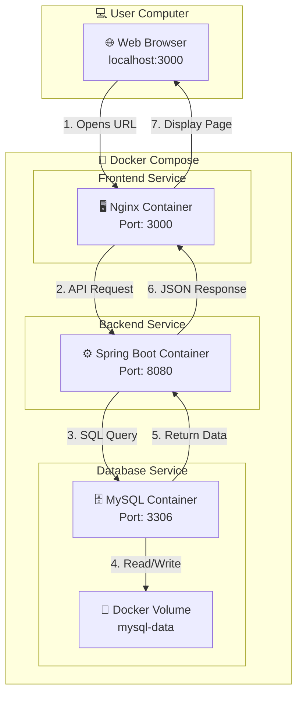

# 🎓 Student Management System

[](https://www.docker.com/)
[](https://spring.io/projects/spring-boot)
[](https://www.mysql.com/)
[](https://maven.apache.org/)

A **production-ready, containerized full-stack application** for managing students, exams, marks, and generating report cards. Built with **Spring Boot**, **MySQL**, **Docker**, and **Maven**.

> 🚀 **One command to run:** `docker-compose up --build`

---

## ✨ Features

### 📚 Student Management
- ✅ Add, Edit, Delete students
- ✅ Roll number and Class fields
- ✅ Parent details (Father, Mother, Parent Phone)
- ✅ Search by name, roll number, email, course
- ✅ Pagination (5/10/20/50 per page)
- ✅ Student status badges (Active🟢 / Inactive🔴 / Graduated🟠)
- ✅ Real-time student count by status
- ✅ Profile modal with complete details
- ✅ Sort by any column (ID, Name, Age, Status, etc.)

### 📝 Marks & Exams
- ✅ Add/Manage exams (with date, semester, academic year)
- ✅ Add subject-wise marks
- ✅ Automatic grade calculation (A+, A, B+, B, C+, C, F)
- ✅ View all marks with student and exam names

### 📊 Results
- ✅ Generate report cards for any exam
- ✅ Show all subjects with marks and grades
- ✅ Calculate total marks, percentage, overall grade
- ✅ Print report card
- ✅ Download report card as PDF

### 📥 Export Features
- ✅ Download student list as CSV
- ✅ Export student list as PDF
- ✅ Batch print student ID cards
- ✅ Print any page

### 🎨 UI Features
- ✅ Dark mode toggle (saves preference in localStorage)
- ✅ Responsive design (works on mobile, tablet, desktop)
- ✅ Real-time search filtering
- ✅ Beautiful gradient UI with smooth animations

---

## 🛠️ Tech Stack

| Category | Technology | Version |
|----------|------------|---------|
| **Backend** | Spring Boot | 2.7.0 |
| **Frontend** | HTML5, CSS3, JavaScript | - |
| **Database** | MySQL | 5.7 |
| **Build Tool** | Apache Maven | 3.8.4 |
| **Containerization** | Docker | Latest |
| **Orchestration** | Docker Compose | Latest |
| **Java** | OpenJDK | 11 |

---
## 🐳 Docker Architecture


---
## 🚀 Quick Start

### Prerequisites

| Requirement | Download Link |
|-------------|---------------|
| Docker Desktop | [Download](https://www.docker.com/products/docker-desktop/) |
| Git (optional) | [Download](https://git-scm.com/) |

### Run the Project

```bash
# Clone the repository
git clone https://github.com/YOUR_USERNAME/StudentManagementSystem.git
cd StudentManagementSystem

# Build and run with Docker Compose
docker-compose up --build

⏱️ First time setup takes 2-3 minutes (downloading Docker images and dependencies)

Access the Application
Service	URL	Credentials
Frontend UI	http://localhost:3000	-
Backend API	http://localhost:8080/api/students	-
PHPMyAdmin	http://localhost:8081	root / root123
Stop the Application
bash
# Stop all containers
docker-compose down

# Stop and delete volumes (reset database)
docker-compose down -v
Built with ☕ using Spring Boot, Docker, and Maven
